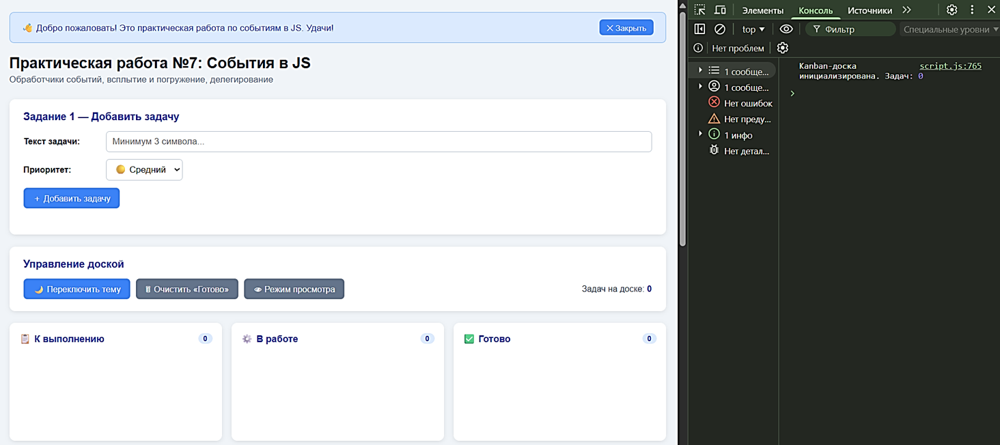
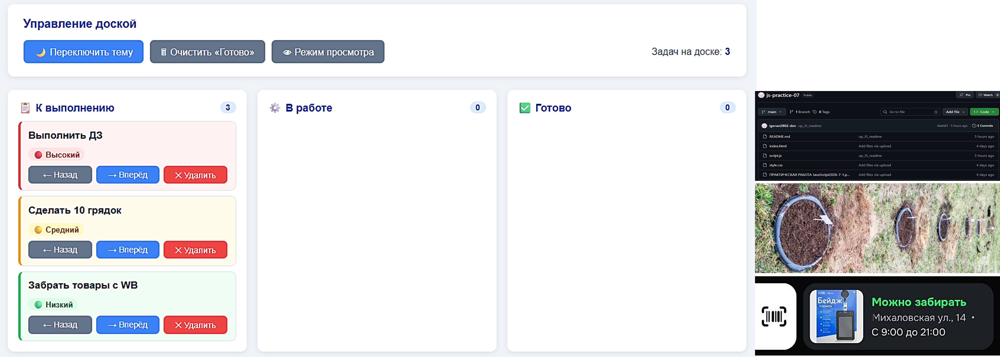
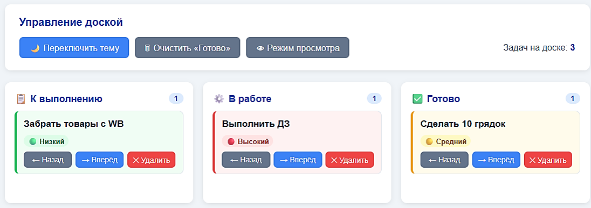
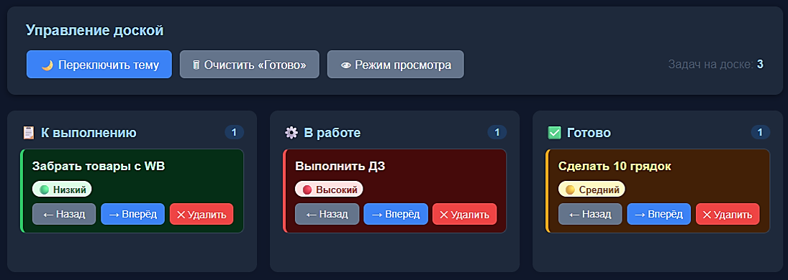
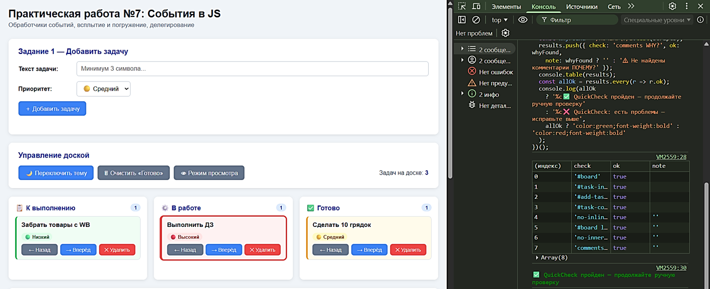

# 📋 Практическая работа №7: События в JS

> Проект «Kanban-доска» — закрепление тем: addEventListener, делегирование событий, всплытие и погружение, localStorage, DocumentFragment.

📁 [Исходный код](https://github.com/igorao2802-dev/js-practice-07)

---

## 🛠 Используемые технологии

| Технология        | Назначение                                                            |
| ----------------- | --------------------------------------------------------------------- |
| HTML5             | Разметка страницы (Форма добавления, Kanban-доска, 3 колонки)         |
| CSS3              | Стилизация интерфейса (карточки задач, кнопки, тёмная тема, анимации) |
| JavaScript (ES6+) | Обработчики событий, делегирование, localStorage, DocumentFragment    |

---

## 📋 Созданные функции и их назначение

### 🌍 Глобальные переменные

| Переменная        | Тип     | Назначение                                            |
| ----------------- | ------- | ----------------------------------------------------- |
| `COLUMN_ORDER`    | Array   | Порядок колонок ['todo', 'in-progress', 'done']       |
| `PRIORITY_COLORS` | Object  | Конфигурация цветов для приоритетов (light/dark темы) |
| `PRIORITY_ORDER`  | Object  | Порядок сортировки по приоритету для PRO              |
| `isViewMode`      | boolean | Флаг режима просмотра (блокировка действий)           |

---

### 🧮 Задание 1: Добавление задачи (createElement) — Уровень БАЗА

| Функция                | Тип                  | Параметры       | Возвращает  | Назначение                                  |
| ---------------------- | -------------------- | --------------- | ----------- | ------------------------------------------- |
| `addTask()`            | Function Declaration | —               | —           | Добавление новой задачи в колонку «todo»    |
| `createTaskCard(task)` | Function Declaration | `task` (object) | HTMLElement | Создание DOM-элемента карточки задачи       |
| `updateCounters()`     | Function Declaration | —               | —           | Обновление счётчиков задач в колонках       |
| `showError(msg)`       | Function Declaration | `msg` (string)  | —           | Вывод сообщения об ошибке валидации         |
| `safeText(node, text)` | Function Declaration | `node`, `text`  | —           | Безопасная установка текста (защита от XSS) |

> 💡 **Почему createElement**: Использую `createElement`, потому что создаю DOM-узел программно, без парсинга HTML. Безопаснее и гибче, чем `innerHTML`. Нет риска XSS, лучше производительность.

> 💡 **Почему textContent**: Использую `textContent`, потому что вставляю текст безопасно, экранируя HTML-теги. Защищает от XSS-атак при вставке данных от пользователя. В отличие от `innerHTML`, не выполняет HTML-код.

```javascript
// createElement: создаю новый DOM-элемент динамически
// Использую createElement, потому что нужно создать элемент программно, а не через innerHTML
const card = document.createElement("div");

// textContent: защита от XSS при выводе пользовательских данных
title.textContent = task.text;
```

---

### 🔍 Задание 2: Делегирование событий (addEventListener) — Уровень JUNIOR

| Метод                      | Тип          | Параметры            | Возвращает | Назначение                           |
| -------------------------- | ------------ | -------------------- | ---------- | ------------------------------------ |
| `board.addEventListener()` | DOM Method   | 'click', handler     | —          | Один обработчик на всю доску #board  |
| `e.target.closest()`       | DOM Method   | `selector` (string)  | Element    | Поиск ближайшего предка по селектору |
| `e.stopPropagation()`      | Event Method | —                    | —          | Остановка всплытия события           |
| `card.classList.toggle()`  | DOM Method   | `className` (string) | boolean    | Переключение класса .selected        |

> 💡 **Почему один обработчик на #board**: Использую делегирование, потому что один обработчик работает для всех карточек, включая добавленные позже. Экономит память, упрощает код. Не нужно вешать обработчик на каждую кнопку.

> 💡 **Почему closest()**: Использую `closest()`, потому что он поднимается по DOM вверх и находит ближайший элемент с нужным селектором. Работает даже если кликнули на дочерний узел (текст внутри кнопки).

> 💡 **Почему stopPropagation()**: Использую `stopPropagation()`, потому что нужно остановить всплытие: клик по кнопке не должен триггерить обработчик выделения карточки.

```javascript
// Делегирование: один обработчик на #board
board.addEventListener("click", boardClickHandler);

// closest: находит ближайшую кнопку с data-action
const actionBtn = e.target.closest("[data-action]");

// stopPropagation: останавливаю всплытие события
e.stopPropagation();
```

---

### 🗑️ Задание 3: Удаление и перемещение (remove + confirm) — Уровень JUNIOR

| Функция                     | Тип                  | Параметры                    | Возвращает | Назначение                          |
| --------------------------- | -------------------- | ---------------------------- | ---------- | ----------------------------------- |
| `deleteCard(card)`          | Function Declaration | `card` (HTMLElement)         | —          | Удаление карточки с подтверждением  |
| `moveCard(card, direction)` | Function Declaration | `card`, `direction` (number) | —          | Перемещение между колонками         |
| `confirm()`                 | Browser API          | `message` (string)           | boolean    | Запрос подтверждения у пользователя |

> 💡 **Почему remove()**: Использую `remove()`, потому что удаляет узел напрямую, без поиска родителя. Короче и читабельнее, чем `parent.removeChild(card)`.

> 💡 **Почему confirm()**: Использую `confirm()`, потому что требую подтверждение перед удалением. Защита от случайного удаления важных задач. Пользователь должен осознанно подтвердить действие.

```javascript
// confirm: требую подтверждение перед удалением
if (!confirm("Удалить задачу?")) return;

// remove: удаляет узел напрямую, без поиска родителя
card.remove();
updateCounters();
```

---

### 🌓 Задание 4: Переключение темы (classList.toggle) — Уровень JUNIOR

| Метод                | Тип        | Параметры            | Возвращает | Назначение                             |
| -------------------- | ---------- | -------------------- | ---------- | -------------------------------------- |
| `classList.toggle()` | DOM Method | `className` (string) | boolean    | Переключение класса .dark-mode на body |

> 💡 **Почему classList.toggle**: Использую `toggle`, потому что если класс есть — удаляет; если нет — добавляет. Повторный клик снимает выделение — удобный UX. Централизованно меняю стили через CSS, не трогая `style` напрямую.

```javascript
// classList.toggle: переключает класс dark-mode на body
// Использую toggle, потому что нужно добавлять/удалять класс одним действием
document.body.classList.toggle("dark-mode");
```

---

### 💾 Задание 5: localStorage (PRO) — Уровень PRO

| Функция             | Тип                  | Параметры | Возвращает | Назначение                                |
| ------------------- | -------------------- | --------- | ---------- | ----------------------------------------- |
| `saveToStorage()`   | Function Declaration | —         | —          | Сохранение всех задач в localStorage      |
| `loadFromStorage()` | Function Declaration | —         | —          | Загрузка задач из localStorage при старте |
| `JSON.stringify()`  | Global Method        | `object`  | string     | Сериализация массива в JSON-строку        |
| `JSON.parse()`      | Global Method        | `string`  | object     | Парсинг JSON-строки в массив объектов     |

> 💡 **Почему JSON.stringify**: Использую `JSON.stringify`, потому что localStorage хранит только строки. Сериализую массив объектов в JSON-строку для сохранения.

> 💡 **Почему JSON.parse**: Использую `JSON.parse`, потому что преобразую JSON-строку обратно в массив объектов при загрузке из localStorage.

```javascript
// localStorage: сохранение состояния
localStorage.setItem("kanban-tasks", JSON.stringify(tasks));

// localStorage: загрузка состояния
const tasks = JSON.parse(localStorage.getItem("kanban-tasks"));
```

---

### 🎯 Задание 6: DocumentFragment (PRO) — Уровень PRO

| Метод                               | Тип        | Параметры        | Возвращает       | Назначение                             |
| ----------------------------------- | ---------- | ---------------- | ---------------- | -------------------------------------- |
| `document.createDocumentFragment()` | DOM Method | —                | DocumentFragment | Создание фрагмента для оптимизации     |
| `fragment.appendChild()`            | DOM Method | `node`           | —                | Добавление узла во фрагмент            |
| `list.insertBefore()`               | DOM Method | `node`, `before` | —                | Вставка узла перед указанным элементом |

> 💡 **Почему DocumentFragment**: Использую `DocumentFragment`, потому что собираю узлы в памяти и вставляю один раз. Избегаю множества reflow/repaint. Без Fragment каждая карточка вызывала бы перерисовку DOM (N раз), с Fragment — только 1 раз.

> 💡 **Почему insertBefore**: Использую `insertBefore`, потому что вставляет узел перед указанным элементом. Если `after=null`, вставляет в конец — поведение как у `appendChild`. Нужно для сортировки по приоритету.

```javascript
// DocumentFragment: вставка за 1 раз, а не N перерисовок
const fragment = document.createDocumentFragment();

DEMO.forEach((task) => {
  fragment.appendChild(createTaskCard(task));
});

todoList.appendChild(fragment); // Только 1 перерисовка DOM
```

---

### 🏷️ Задание 7: { once: true } и removeEventListener (PRO) — Уровень PRO

| Метод                   | Тип        | Параметры               | Возвращает | Назначение                                         |
| ----------------------- | ---------- | ----------------------- | ---------- | -------------------------------------------------- |
| `addEventListener()`    | DOM Method | event, handler, options | —          | Навешивание обработчика с опцией { once: true }    |
| `removeEventListener()` | DOM Method | event, handler          | —          | Удаление обработчика (требует именованную функцию) |

> 💡 **Почему { once: true }**: Использую `{ once: true }`, потому что обработчик автоматически удалится после первого срабатывания. Идеально для одноразовых действий (баннеры, подсказки). Не нужно вручную вызывать `removeEventListener`.

> 💡 **Почему именованная функция для removeEventListener**: `removeEventListener` требует ту же ссылку, что была передана в `addEventListener`. Анонимная функция — другая ссылка, удаление не сработает.

```javascript
// { once: true }: обработчик сработает ровно один раз
closeBannerBtn.addEventListener(
  "click",
  () => {
    welcomeBanner.style.display = "none";
  },
  { once: true },
);

// removeEventListener: требует именованную функцию
board.removeEventListener("click", boardClickHandler);
```

---

## ❓ Ответы на контрольные вопросы (Interview Questions)

### 1. Что такое делегирование событий и зачем оно нужно?

> **Делегирование событий** — это техника, когда обработчик вешается не на каждый элемент, а на их общего родителя. Событие всплывает от целевого элемента к родителю, где обрабатывается.

**Преимущества:**
| Без делегирования | С делегированием |
|------------------|------------------|
| N обработчиков на N кнопок | 1 обработчик на #board |
| Нужно перевешивать при добавлении | Работает для новых элементов |
| Больше потребление памяти | Экономия памяти |

**Пример:**

```javascript
// Без делегирования (плохо):
document.querySelectorAll(".delete-btn").forEach((btn) => {
  btn.addEventListener("click", deleteHandler);
});

// С делегированием (хорошо):
board.addEventListener("click", (e) => {
  const btn = e.target.closest(".delete-btn");
  if (btn) deleteHandler(btn);
});
```

---

### 2. Чем `event.target` отличается от `event.currentTarget`?

| Свойство              | Описание                                             | Пример                 |
| --------------------- | ---------------------------------------------------- | ---------------------- |
| `event.target`        | Элемент, на котором **произошло** событие (кликнули) | Кнопка внутри карточки |
| `event.currentTarget` | Элемент, на котором **висит** обработчик             | Доска #board           |

**Пример:**

```javascript
board.addEventListener("click", (e) => {
  console.log(e.target); // Кнопка, на которую кликнули
  console.log(e.currentTarget); // #board (где висит обработчик)
});
```

---

### 3. Что делает `stopPropagation()` и когда его использовать?

> **`stopPropagation()`** останавливает всплытие события вверх по DOM-дереву.

**Когда использовать:**

- Клик по кнопке внутри карточки не должен выделять саму карточку
- Предотвращение срабатывания родительских обработчиков
- Изоляция событий вложенных элементов

**Пример:**

```javascript
card.addEventListener("click", () => {
  console.log("Карточка выделена");
});

deleteBtn.addEventListener("click", (e) => {
  e.stopPropagation(); // Не выделять карточку при удалении
  card.remove();
});
```

---

### 4. Чем `addEventListener` лучше `onclick`?

| Критерий                   | `addEventListener`              | `onclick`                    |
| -------------------------- | ------------------------------- | ---------------------------- |
| **Несколько обработчиков** | ✅ Можно добавить несколько     | ❌ Перезаписывает предыдущий |
| **Опции**                  | ✅ `{ once, passive, capture }` | ❌ Нет опций                 |
| **Удаление**               | ✅ `removeEventListener`        | ❌ Только `onclick = null`   |
| **Делегирование**          | ✅ Работает                     | ❌ Не работает               |

**Пример:**

```javascript
// addEventListener (хорошо):
btn.addEventListener("click", handler1);
btn.addEventListener("click", handler2); // Оба работают

// onclick (плохо):
btn.onclick = handler1;
btn.onclick = handler2; // handler1 перезаписан!
```

---

### 5. Что такое `{ once: true }` в `addEventListener`?

> **`{ once: true }`** — опция, которая автоматически удаляет обработчик после первого срабатывания.

**Когда использовать:**

- Одноразовые баннеры и подсказки
- Приветственные сообщения
- Туториалы для новых пользователей

**Пример:**

```javascript
// Обработчик сработает только 1 раз и удалится автоматически
banner.addEventListener(
  "click",
  () => {
    banner.classList.add("hidden");
  },
  { once: true },
);

// Без { once: true } пришлось бы вручную:
banner.addEventListener("click", function hide() {
  banner.classList.add("hidden");
  banner.removeEventListener("click", hide);
});
```

---

### 6. Почему `removeEventListener` требует именованную функцию?

> **`removeEventListener`** требует ту же **ссылку на функцию**, что была передана в `addEventListener`.

**Проблема с анонимными функциями:**

```javascript
// НЕ РАБОТАЕТ:
board.addEventListener('click', () => { ... });
board.removeEventListener('click', () => { ... }); // Другая ссылка!

// РАБОТАЕТ:
function boardClickHandler(e) { ... }
board.addEventListener('click', boardClickHandler);
board.removeEventListener('click', boardClickHandler); // Та же ссылка!
```

**Почему:** Каждая анонимная функция — это новый объект в памяти. `removeEventListener` не может найти «ту же самую» функцию.

---

## 📸 Скриншоты работы

#### Пустая доска при первом запуске



#### Несколько задач с разными приоритетами в колонке «К выполнению»



#### Задачи перемещены по колонкам



#### Тёмная тема включена



#### DevTools → Console: нет ошибок + результат QuickCheck



---

## 📝 Инструкция по запуску

1. **Клонируйте репозиторий:**

   ```bash
   git clone https://github.com/igorao2802-dev/js-practice-07.git
   cd js-practice-07
   ```

2. **Откройте в VS Code:**

   ```bash
   code .
   ```

3. **Запустите Live Server:**
   - Установите расширение "Live Server" (если нет)
   - Нажмите правой кнопкой на `index.html` → "Open with Live Server"

4. **Проверьте в браузере:**
   - Откройте DevTools (F12)
   - Убедитесь, что в Console нет ошибок
   - Протестируйте все функции проекта

---

_Выполнил: Оcадчий И.А._  
_Дата: 29.03.2026_  
_Группа: 2509_
